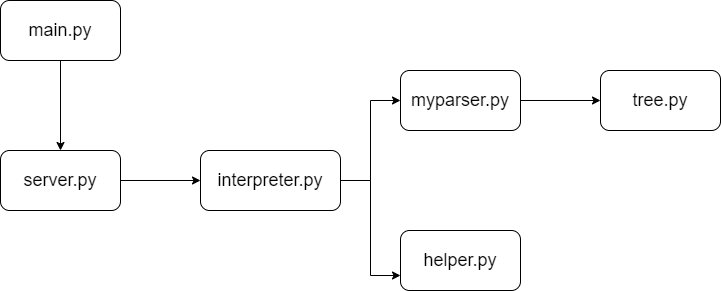
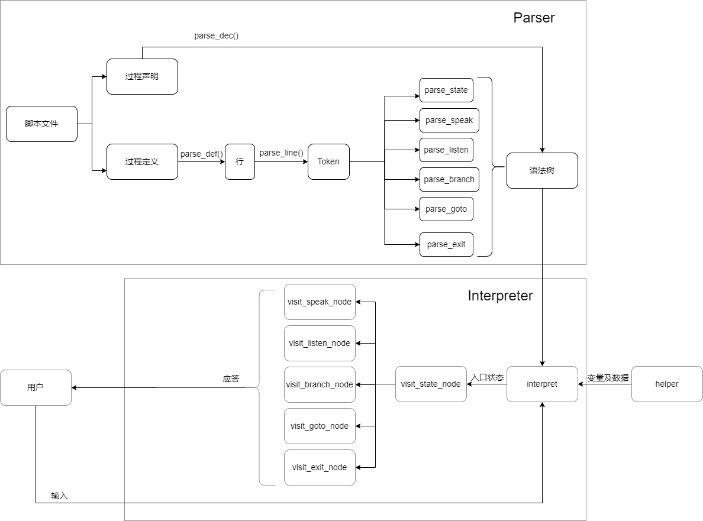
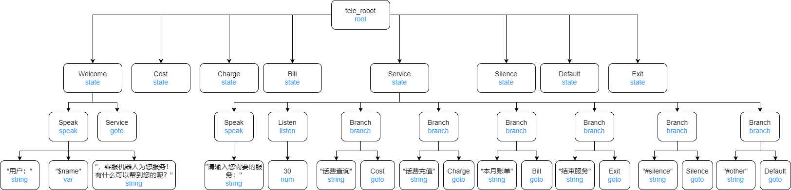
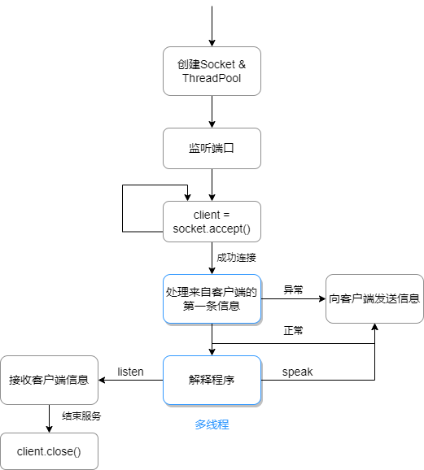
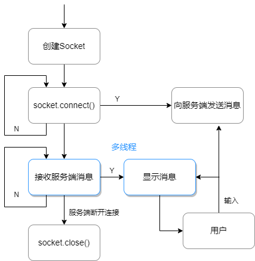
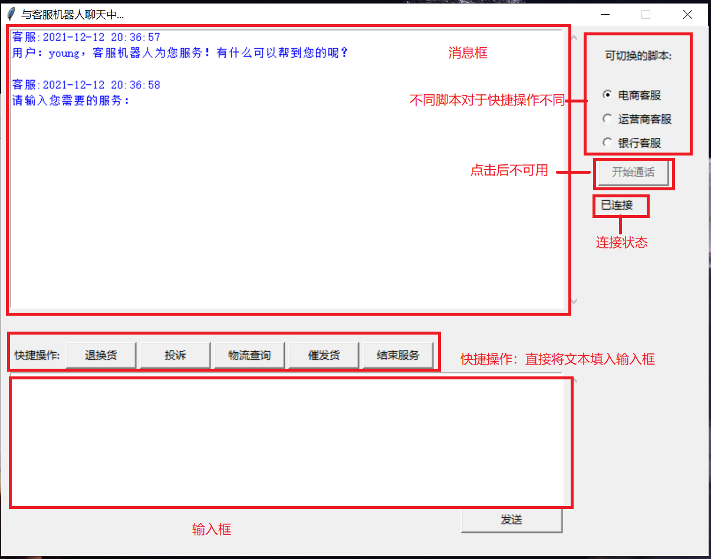

# 详细说明文档


[toc]


## 一、作业要求

### 1.1 作业题目

一种领域特定脚本语言的解释器的设计与实现、

### 1.2  作业内容

本作业要求定义一个领域特定脚本语言，这个语言能够描述在线客服机器人（机器人客服是目前提升客服效率的重要技术，在银行、通信和商务等领域的复杂信息系统中有广泛的应用）的自动应答逻辑，并设计实现一个解释器解释执行这个脚本，可以根据用户的不同输入，根据脚本的逻辑设计给出相应的应答。

### 1.3 基本要求

1. 脚本语言的语法可以自由定义，只要语义上满足描述客服机器人自动应答逻辑的要求。

2. 程序输入输出形式不限，可以简化为纯命令行界面。

3. 应该给出几种不同的脚本范例，对不同脚本范例解释器执行之后会有不同的行为表现。


## 二、编程语言及程序运行环境

编程语言：Python3

Python版本：3.9

IDE：PyCharm

OS：Windows 10


## 三、实现情况

1. 定义了一门领域特定脚本语言RSL，可以描述在线客服机器人的自动应答逻辑。

2. 针对自定义的RSL编程实现了解释器。

3. 程序采用CS结构，分为服务端和客户端两个程序，支持多客户端并发。服务端具备脚本解释器和socket通信功能，用户通过客户端与服务端进行通信，实现了在线的客服机器人对话。

4. 通过Python自带的Tkinter库编写GUI应用程序，服务端可以查看在线用户列表和日志，客户端采用常见的聊天窗口模式，便于人机交互。 


## 四、详细设计

### 4.1 服务端

#### 4.1.1 模块划分



| 模块           | 主要功能               |
| -------------- | ---------------------- |
| main.py        | 程序入口               |
| server.py      | 解释程序、socket通信   |
| interpreter.py | 解释器                 |
| myparser.py    | 语法分析器, 构建语法树 |
| tree.py        | 语法树结构             |
| helper.py      | 数据查询               |


#### 4.1.2 类的设计与数据结构

myparser.py

```python
# 符号表
class SymbolTable(object):
    def __init__(self):
        self.state_list = []    # 状态列表
        self.var_list = []      # 变量列表
        self.entry_state = ""   # 入口状态

    def register_state(self, state): #将状态名添加到符号表中
    def register_var(self, var): #将变量名添加到符号表中
```

```python
# 语法分析器
class Parser(object):
    def __init__(self, filepath):
        self.current_state = "" # 当前状态名
        self.current_state_node = None  # 当前状态节点
        self.symbol_table = SymbolTable()   # 符号表
        self.declaration = []   # 脚本的过程声明
        self.definition = []    # 脚本的过程定义
        self.filepath = filepath    # 脚本文件路径
        filename = os.path.basename(filepath).split('.')[0]  # 脚本名
        self.tree = Node(filename,'root')  # 语法树

    def get_tree(self):  # 返回语法树
    def get_symbol_table(self):  # 返回符号表
    def run(self):  # 开始分析脚本
    def parse_dec(self):  # 处理states声明
    def parse_def(self): #处理state定义
    def parse_line(self, line):  # 处理每一行定义
    def parse_state(self, line):  #分析 state token
    def parse_speak(self, line):  #分析 speak token
    def parse_listen(self, line):  # 分析 listen token
    def parse_branch(self, line):  # 分析 branch token
    def parse_goto(self, line):  # 分析 goto token
    def parse_exit(self, line):  # 分析 exit token
```

tree.py

```python
# 树节点
class Node(object):
    def __init__(self, value="", type=""):
        self.value = value  # 节点值
        self.type = type  # 节点类型
        self.children = []  # 孩子节点列表

    def add(self, child):  # 添加子节点
    def get_node(self, root, value, type):  # 查找节点

# 不同类型的树节点
class StateNode(Node):
    def __init__(self, name):
        super(StateNode,self).__init__(name,'state')

class SpeakNode(Node):
    def __init__(self, expr_list):
        super(SpeakNode, self).__init__('speak', 'speak')
        for expr in expr_list:
            if expr[0] == '$':
                expr_node = VarNode(expr[1:])
            else:
                expr_node = StringNode(expr)
            self.add(expr_node)

class ListenNode(Node):
    def __init__(self, time):
        super(ListenNode, self).__init__('listen', 'listen')
        time_node = NumNode(time)
        self.add(time_node)

class BranchNode(Node):
    def __init__(self, answer, name):
        super(BranchNode, self).__init__('branch', 'branch')
        answer_node = StringNode(answer)
        goto_node = GotoNode(name)
        self.add(answer_node)
        self.add(goto_node)

class GotoNode(Node):
    def __init__(self, name):
        super(GotoNode, self).__init__(name, 'goto')

class ExitNode(Node):
    def __init__(self, name):
        super(ExitNode, self).__init__(name, 'exit')

class StringNode(Node):
    def __init__(self, value):
        super(StringNode, self).__init__(value, 'string')

class VarNode(Node):
    def __init__(self, value):
        super(VarNode, self).__init__(value, 'var')

class NumNode(Node):
    def __init__(self, value):
        super(NumNode, self).__init__(value, 'num')
```

helper.py

```python
# 数据查询类
class Helper(object):
    def __init__(self, user_id, script_name):
        self.user_id = user_id  # 用户ID
        self.script_name = script_name  # 脚本名称
        filepath = "./data/" + script_name + ".json"  # 数据文件路径
        with open(filepath, 'r', encoding='utf8') as fp:
            self.data = json.load(fp)
        fp.close()

    def get_value(self, var, answer=""):  # 查找变量对应数据
```

interpreter.py

```python
# 解释器
class Interpreter(object):
    def __init__(self, parser, user_id, script_name):
        self.user_id = user_id  # 用户ID
        self.parser = parser  # 语法分析器
        self.ASTtree = parser.tree  # 语法树
        self.helper = Helper(user_id, script_name)  # 数据查询
        self.entry_state = parser.symbol_table.entry_state  # 入口状态
        self.entry_node = self.ASTtree.get_node(self.ASTtree, self.entry_state, 'state')  # 入口状态节点
        self.answer = ""  # 最近用户输入
```

server.py

```python
# 服务器，包括界面、socket通信、解释程序
class Server(object):
    def __init__(self, ip, port):
        self.ip = ip  # 用户ip地址
        self.port = port  # 端口号
        self.socket = socket(AF_INET, SOCK_STREAM)
        self.socket.setblocking(False)  # 服务端套接字设置为非阻塞
        self.socket.setsockopt(SOL_SOCKET, SO_REUSEADDR, 1)  # 设置端口复用
        self.socket.bind((self.ip, self.port))
        self.thread_pool = ThreadPool(10)
        # 客户端信息
        self.user_list = []  # 在线用户列表
        self.user_dict = {}  # 记录在线的用户信息
        self.parser_dict = {}  # 分析器字典 <script_name,parser>
        self.it_dict = {}  # 解释器字典 <user_id,interpreter>
        self.msg_dict = {}  # 用户的最新消息字典 <user_id,msg>
        # UI
        self.window = tk.Tk()  # UI窗口
		...

    def __del__(self):  # 析构函数，销毁窗口和套接字

    def run(self):  #主线程执行函数
    def write_log(self, msg, tag=""):  # 服务端界面日志输出
    """
    socket通信模块
    """
    def recv_first_come(self, client):  #处理客户端的第一条信息，根据脚本创建语法树
    def recv_send_msg(self, user_id, time_limit):  #接收客户端消息
    def send_client_msg(self, user_id, msg):  #发送消息至客户端

    """
    解释器
    """
    def interpret(self, user_id, script_name):  #解释程序
    def visit_state_node(self, node, user_id):  # 访问state节点
    def visit_speak_node(self, node, user_id):  #访问speak节点
    def visit_listen_node(self, node, user_id):  # 访问listen节点
    def visit_branch_node(self, node, user_id):  # 访问branch节点
    def visit_goto_node(self, node, user_id):  #访问goto节点
    def visit_exit_node(self, node, user_id):  # 访问exit节点
```


#### 4.1.3 解释程序结构



语法树示例：（仅展示部分）




#### 4.1.4 socket通信




#### 4.1.5 测试

测试框架：Pytest

##### 4.1.5.1 测试桩：

test_helper.py

```python
import pytest
from RSL_pkg.helper import Helper


datapath = "./data/id_script.txt"
data = []
with open(datapath, 'r', encoding='utf8') as fp:
    for line in fp:
        line = line.rstrip()
        newline = tuple(line.split())
        data.append(newline)


@pytest.mark.parametrize(
    "user_id,script_name",
    data,
    ids=["case" + "{}".format(i) for i in range(1,len(data)+1)]
)
def test_init(user_id, script_name):
    assert Helper(user_id,script_name)


@pytest.mark.parametrize(
    "user_id,script_name",
    data,
    ids=["case" + "{}".format(i) for i in range(1,len(data)+1)]
)
def test_get_value(user_id, script_name):
    h = Helper(user_id, script_name)
    val1 = h.get_value("name")
    val2 = h.get_value("nam")
    assert val1 is not None, "查找到结果:%s" % val1
    assert val2 is None, "查找到结果:%s" % val2


if __name__ == '__main__':
    pytest.main(["-s", "test_helper.py"])
```

test_interpreter.py

```python
import pytest
from RSL_pkg import interpreter
from RSL_pkg import myparser

p = myparser.Parser("..\\script\\bank_robot.txt")

@pytest.mark.parametrize(
    "parser,user_id,script_name",
    [(p,"1","bank_robot"),
     (p,"12","online_shop_robot"),
     (p,"3","tele_robot"),
     (p,"40","robot"),
     (p,"sa","tele"),
     (p,"2ef3","tele_robot"),
     (p,"a","tele_robot"),
     (p,"7","tele_robot")],
    ids=["case" + "{}".format(i) for i in range(1,9)]
)
def test_init(parser, user_id, script_name):
    assert interpreter.Interpreter(parser,user_id,script_name)

if __name__ == '__main__':
    pytest.main(["-s", "test_interpreter.py"])
```

test_myparser.py

```python
import pytest
from RSL_pkg import myparser

datapath = "./data/filename.txt"
data = []
with open(datapath, 'r', encoding='utf8') as fp:
    for line in fp:
        line = line.rstrip()
        data.append(line)

@pytest.mark.parametrize(
    "file_name",
    data,
    ids=["case" + "{}".format(i) for i in range(1,len(data)+1)]
)
def test_init(file_name):
    p = myparser.Parser(file_name)

def test_run(file_name):
    p1 = myparser.Parser(file_name)
    assert p1.run()


if __name__ == '__main__':
    pytest.main(["-s", "test_myparser.py"])
```


##### 4.1.5.2 自动测试脚本

test_server.py

模拟多个客户端与服务端同时进行通信，随机发送消息测试各个应答环境。

```python
import pytest
from socket import *
import pickle
import random
import time
from RSL_pkg import server
from multiprocessing.pool import ThreadPool

@pytest.mark.parametrize(
    "ip,port",
    [('127.0.0.1',8888)]
)
def testServer(ip,port):
    thread_pool = ThreadPool(10)
    thread_pool.apply_async(func=testConnection, args=(ip, port))
    thread_pool.apply_async(func=testConnection, args=(ip, port))
    thread_pool.apply_async(func=testConnection, args=(ip, port))
    thread_pool.apply_async(func=testConnection, args=(ip, port))
    thread_pool.apply_async(func=testConnection, args=(ip, port))
    # server
    s = server.Server(ip, port)


def testConnection(ip, port):
    user_id = str(random.randint(1, 10))
    client = socket(AF_INET, SOCK_STREAM)
    thread_pool = ThreadPool(3)
    while True:
        try:
            client.connect((ip, port))
            first_msg = {
                'flag': 'first',
                'data': {
                    'user_id': user_id,
                    'script_name': "online_shop_robot"
                }
            }
            client.send(pickle.dumps(first_msg))
            thread_pool.apply_async(func=recv_msg,args=(client,user_id))
            break
        except BlockingIOError:  # 未发送信息
            pass
        except ConnectionResetError:  # 服务器断开连接
            pass

def recv_msg(client, user_id):
    print("recv_msg")
    # 自动应答
    while True:
        time.sleep(1)
        try:
            orign_data = client.recv(1024)
            data = pickle.loads(orign_data)
            print("recv from server: {}".format(data))
            if data.get('flag') == 'repeat':
                print("Same UserID")
                break
            elif data.get("flag") == "start":
                pass
            elif data['data']['message'] == "请输入您需要的服务：":
                print("1")
                answer = ["物流查询","退换货","投诉","催发货","结束服务"]
                index = random.randint(0, 4)
                msg = {
                    'flag': 'answer',
                    'data': {
                        'message': answer[index]
                    }
                }
                print(msg)
                client.send(pickle.dumps(msg))
            elif "请输入订单号" in data['data']['message']:
                msg = {
                    'flag': 'answer',
                    'data': {
                        'message': "12345-"+user_id
                    }
                }
                client.send(pickle.dumps(msg))
            elif "您的意见" in data['data']['message']:
                msg = {
                    'flag': 'answer',
                    'data': {
                        'message': "很久不发货"
                    }
                }
                client.send(pickle.dumps(msg))
            elif "五星好评" in data['data']['message']:
                break
            else:
                pass
        except BlockingIOError:  # 未发送信息
            pass
        except ConnectionResetError:  # 服务器断开连接
            break
```


### 4.2 客户端

#### 4.2.1 socket通信




## 五、使用指南

### 5.1 客户端

界面划分如图：



1. 开始时不可发送消息，连接状态为“未连接”。
2. 选定脚本，点击“开始通话”按钮后开始连接客户端。
3. 连接成功后，连接状态显示“已连接”，“开始通话”按钮不可用，“发送”按钮可用。


### 5.2 服务端

界面划分如下：


1. 打开程序后自动监听连接。
2. 客户端成功连接后，用户ID会显示在列表中。
3. 客户端断开连接后，用户ID从列表中移除。
4. 日志显示函数执行及接收、发送的消息。


## 六、RSL语法规范

### 6.1 注释

Robot DSL 采用单行注释，以“#”开头

```
# 这是一条注释
```


### 6.2 变量

#### 6.2.1 变量的声明与定义

变量无需声明，格式为：`$变量名`。

变量名可以由数字(0-9)，字母(a-z,A-Z) 以及下划线 (_) 构成，首字母必须为字母或下划线。

```
speak $name
```

#### 6.2.2 变量的前缀

变量名可以有前缀，表示查询数据字典时的递进关系。

```
speak "您的余额为：" + $order.answer.logistics + "元"
```

#### 2.3 特殊的变量

`$answer`: 用户最近输入

`$user_id`: 用户ID


### 6.3 常量

#### 6.3.1 字符串

字符串用双引号标识，字符串之间、字符串和变量之间、变量和变量之间都可以通过 “+” 拼接。

```
speak "您的物流状态为：" + $order.answer.state + ",物流：" + $order.answer.logistics
```

#### 6.3.2 数字

数字可以直接表示，暂时只支持整型。

```
listen 20
```


### 6.4 指令

#### 6.4.1 speak

客服机器人向用户发送消息的指令。

用法：`speak <表达式>`

（表达式由字符串和变量表示）

```
speak "用户：" + $name + "，客服机器人为您服务！有什么可以帮到您的呢？"
```

#### 6.4.2 listen

等待用户输入的指令。

用法：`listen <等待时间>`

```
listen 30
```

#### 6.4.3 branch

根据用户输入进行分支判断，与keyword（通常为不带双引号的字符串）匹配后进入相应过程的指令。

branch与listen搭配使用，通常几个branch一起出现，表示多个分支。

用法：`branch <keyword> <state>`

```
branch 话费查询 Cost
branch 话费充值 Charge
branch 本月账单 Bill
branch 结束服务 Exit
branch #silence Silence
branch #other Default
```

特殊的keyword:

`#silence`: listen等待用户输入超时

`#other`: 用户输入与其他keyword不匹配，必须放在最后一个branch

#### 6.4.4 goto

过程转移的指令。

用法：`goto <state>`

```
goto Service
```

#### 6.4.5 exit

退出对话的指令，后面不加任何参数。

```
exit
```


### 6.5 过程

过程用`state`标识，过程名由字母和下划线组成，通常首字母大写。

#### 6.5.1 过程的定义

过程中可以定义多条指令，指令顺序执行，必须以`end`结尾。

```
state Service
    speak "请输入您需要的服务："
    listen 30
    branch 话费查询 Cost
    branch 话费充值 Charge
    branch 本月账单 Bill
    branch 结束服务 Exit
    branch #silence Silence
    branch #other Default
end
```

#### 6.5.2 过程的声明

过程必须在脚本文件开头集体声明。

```
states
    Welcome
    Service
    Search
    Deposit
    Withdraw
    Silence
    Default
    Exit
end
```


### 6.6 脚本

#### 6.6.1 脚本文件类型

脚本采用文本文件 (.txt) 编写。

#### 6.6.2 脚本文件的组织

一个脚本由过程声明和过程定义组成，定义了一个客服机器人的应答逻辑。

过程声明必须放在脚本文件开头，声明的第一个过程为程序的入口过程。

过程定义可以不对于声明中的顺序。

例1. online_shop_robot.txt

```
states
    Welcome
    Service
    Refund
    Complain
    Search
    Consign
    Silence
    Default
    Exit
end

state Welcome
    speak "用户：" + $name + "，客服机器人为您服务！有什么可以帮到您的呢？"
    goto Service
end

state Service
    speak "请输入您需要的服务："
    listen 30
    branch 退换货 Refund
    branch 投诉 Complain
    branch 物流查询 Search
    branch 催发货 Consign
    branch 结束服务 Exit
    branch #silence Silence
    branch #other Default
end

state Refund
    speak "请输入订单号："
    listen 20
    speak "您已成功退换货。"
    goto Service
end

state Complain
    speak "您的意见是我们改进工作的动力"
    listen 20
    speak "我们后续会对您的建议进行处理，谢谢！"
    goto Service
end

state Search
    speak "请输入订单号："
    listen 30
    speak "您的物流状态为：" + $order.answer.state + ",物流：" + $order.answer.logistics
    goto Service
end

state Consign
    speak "请输入订单号："
    listen 30
    speak "已经催促店家发货啦，请耐心等待！"
    goto Service
end

state Silence
    speak "听不清，请您大声一点可以吗？"
    goto Service
end

state Default
    speak "对不起，我不理解您的意思。"
    goto Service
end

state Exit
    speak "本次服务结束，期待您的五星好评！"
    exit
end
```

例2. tele_robot.txt

```
states
    Welcome
    Service
    Cost
    Charge
    Bill
    Silence
    Default
    Exit
end

state Welcome
    speak "用户：" + $name + "，客服机器人为您服务！有什么可以帮到您的呢？"
    goto Service
end

state Service
    speak "请输入您需要的服务："
    listen 30
    branch 话费查询 Cost
    branch 话费充值 Charge
    branch 本月账单 Bill
    branch 结束服务 Exit
    branch #silence Silence
    branch #other Default
end

state Cost
    speak "您的话费余额为:" + $money + "元"
    goto Service
end

state Charge
    speak "请输入充值金额："
    listen 20
    speak "充值成功！"
    goto Service
end

state Bill
    speak "您本月已花费:" + $month_cost + "元"
    goto Service
end

state Silence
    speak "听不清，请您大声一点可以吗？"
    goto Service
end

state Default
    speak "对不起，我不理解您的意思。"
    goto Service
end

state Exit
    speak "本次服务结束，期待您的五星好评！"
    exit
end
```

例3. bank_robot.txt

```
states
    Welcome
    Service
    Search
    Deposit
    Withdraw
    Silence
    Default
    Exit
end

state Welcome
    speak "用户：" + $name + "，客服机器人为您服务！有什么可以帮到您的呢？"
    goto Service
end

state Service
    speak "请输入您需要的服务："
    listen 30
    branch 余额查询 Search
    branch 存款 Deposit
    branch 取款 Withdraw
    branch 结束服务 Exit
    branch #silence Silence
    branch #other Default
end

state Search
    speak "您的银行卡余额为：" + $money + "元"
    goto Service
end

state Deposit
    speak "请输入存款金额："
    listen 20
    speak "存款成功！"
    goto Service
end

state Withdraw
    speak "请输入取款金额："
    listen 20
    speak "取款成功！"
    goto Service
end

state Silence
    speak "听不清，请您大声一点可以吗？"
    goto Service
end

state Default
    speak "对不起，我不理解您的意思。"
    goto Service
end

state Exit
    speak "本次服务结束，期待您的五星好评！"
    exit
end
```

